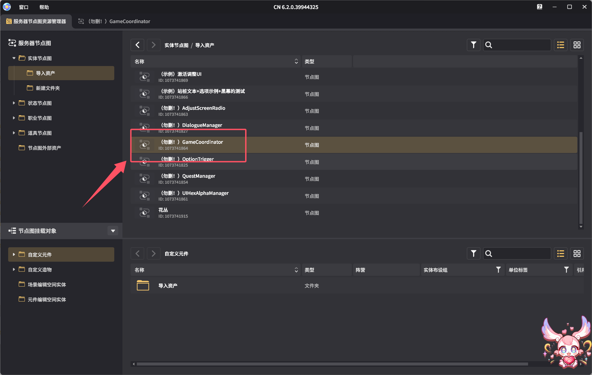
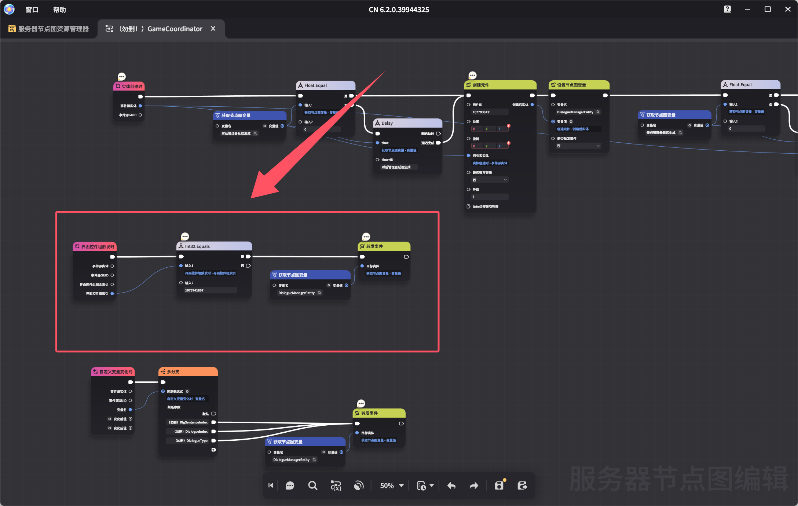

# 更新日志

## 2025.12.3
 - 修复了元件版调整Gamecoordinator节点图的按键索引后仍然无法正常使用下一句话按钮的问题
	::: details 手动修复
	1.在节点图中找到`（勿删！）Gamecoordinator`
	
	
	2.双击进入后，注意到红框这里的`界面控件触发时`，后面的`Int32.Equals复合节点`
		
		
	3.拉出一个获取节点图变量，小齿轮类型设置成整数（或者直接从节点图变量处拉出来获取节点图变量），节点图变量名设置成`「（勿删）对话下一句按钮」索引`即可
	
	
	:::
 - 修复了`（勿删！）Gamecoordinator`节点图创建管理器时可能会出现的飞线问题

# 2025.11.25 v0.1.10.9
 - 更新了运镜功能